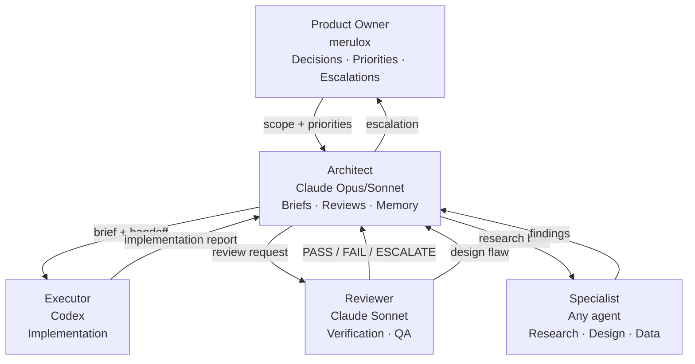
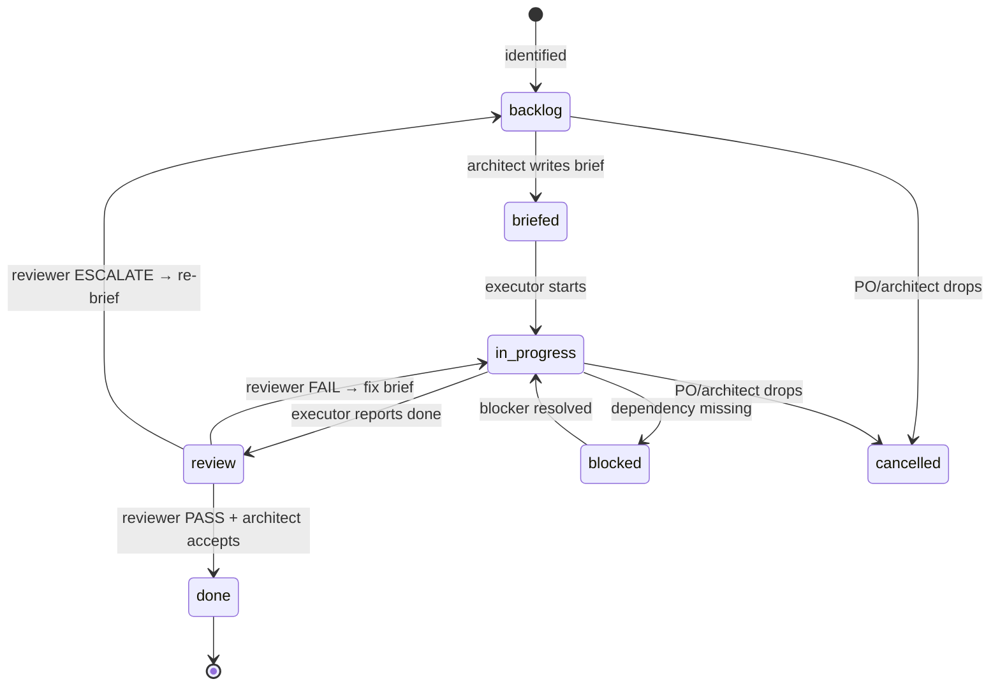
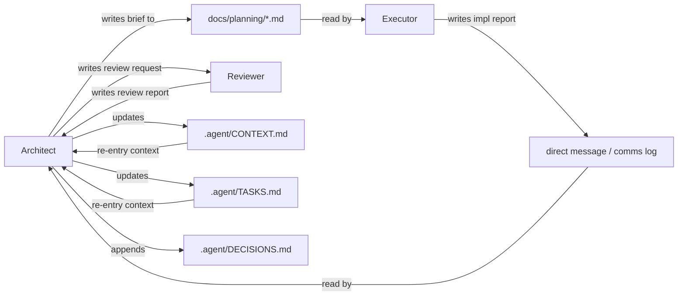
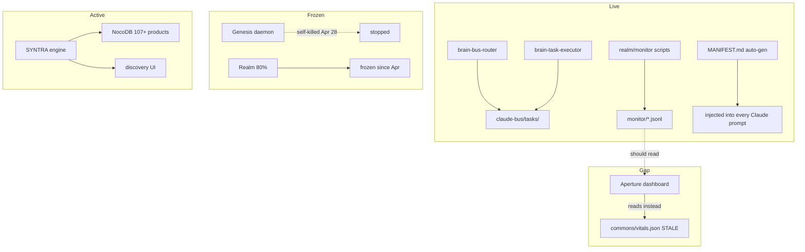

# System Map — agent-infra + Ecosystem

**Date:** 2026-06-05  
**Maintainer:** Architect  
**Source of truth:** `ecosystem-review/` docs

---

## The eight-layer mental model

```
METHODOLOGY:  Agent Infra        — how we build (governs all projects)
PRODUCT:      SYNTRA             — what we sell (curated EDC)
PUBLIC FACE:  merulox.com        — what others see
─────────────────────────────────────────────────────────────────────
AGENT:        Genesis            — the autonomous actor (frozen/broken)
ENVIRONMENT:  Realm (state)      — where Genesis runs + doctrine
ENGINE:       brain-* scripts    — the code that drives Realm
INTERFACE:    Aperture           — the window onto Genesis/Realm
KNOWLEDGE:    Obsidian vault     — the long-term knowledge graph
```

---

## Agent Infra — roles and responsibilities



### Role boundaries (what each role owns)

| Role | Owns | Cannot |
|------|------|--------|
| Product Owner | Direction, priorities, escalation decisions | Write code, write briefs |
| Architect | Briefs, project memory, verification, decisions | Write production code (>5 lines), approve own work |
| Executor | Implementation, implementation reports | Change scope, mark own work done |
| Reviewer | Verify commands, pass/fail verdict | Rewrite implementation, lower acceptance criteria |
| Specialist | Domain-specific research/output | Architecture decisions |

---

## Task lifecycle



**Rule:** Nothing goes from backlog directly to an executor. Brief first.  
**Rule:** Done = verification commands ran + reviewer confirmed (for [DATA] tasks) + architect accepted + files updated.

---

## Persistence layers

| Layer | Location | What it stores | Owner | Consumed by |
|-------|----------|---------------|-------|-------------|
| Project memory | `<project>/.agent/` | CONTEXT, TASKS, DECISIONS, RISKS | Architect | Architect on re-entry |
| Task briefs | `<project>/docs/planning/` | Exact implementation specs | Architect | Executor, Reviewer |
| Agent comms log | `<project>/.agent/logs/agent-comms.md` | Architect↔executor↔reviewer messages | All agents | Architect, PO |
| Session log | `<project>/.agent/logs/session-log.md` | Session summaries | Architect | Architect, PO |
| Obsidian vault | `~/obsidian/` | Long-term knowledge, claims, domains | brain-ingest, human | Claude sessions (injected) |
| Realm commons | `~/projects/realm/commons/` | Operational state (mostly frozen) | brain-* scripts | Aperture (stale) |
| Realm monitor | `~/projects/realm/monitor/` | Live service health + Genesis bug ledger | monitor scripts | **Nothing — gap** |
| Claude memory | `~/.claude/projects/*/memory/` | Session continuity, signals, rules | Director sessions | Claude on re-entry |
| brain-* state | `~/obsidian/claude-bus/` | Inter-instance task queue | brain-bus-router | brain-task-executor |

---

## Communication paths



**Inter-instance coordination (brain-bus):**
```
brain-bus-router (live) ──> routes tasks via ~/obsidian/claude-bus/tasks/
brain-task-executor (live) ──> claims + executes queued shell tasks
Instance X ──> brain-task claim --role any
```

---

## Recovery mechanisms

| Mechanism | How | When to use |
|-----------|-----|-------------|
| Project re-entry | Read `.agent/CONTEXT.md` + `TASKS.md` | Start of any architect session |
| Role restoration | Read `~/agent-infra/agents/architect.md` | Lost role clarity |
| MVAOS compact recovery | Read `~/agent-infra/mvaos/ARCHITECT.md` + `SESSION_RECOVERY.md` | Quick context restore |
| Global CLAUDE.md | `~/.claude/CLAUDE.md` | System-wide preferences + environment facts |
| Agent-infra CLAUDE.md | `~/agent-infra/CLAUDE.md` | Repo-specific role + active work state |
| brain-status | `brain-status` | See all active Claude instances |
| session-log | `<project>/.agent/logs/session-log.md` | Audit trail of past sessions |

**Minimum recovery prompt (paste to any new Claude session):**
```
Read ~/agent-infra/agents/architect.md.
Read ~/syntra/.agent/CONTEXT.md.
Read ~/syntra/.agent/TASKS.md.
Identify any in_progress tasks. Verify live state before assuming done.
Resume as architect.
```

---

## Ecosystem: data flow (actual, 2026-06-05)



---

## Project adoption status

| Project | .agent/ | CONTEXT.md | TASKS.md | DECISIONS.md | Briefs | CLAUDE.md |
|---------|:-------:|:----------:|:--------:|:------------:|:------:|:---------:|
| SYNTRA | ✅ | ✅ current | ✅ current | ✅ | ✅ B1 | ❌ |
| agent-infra | ❌ | ❌ | ❌ | ❌ | — | ❌ → creating |
| Genesis | ❌ | ❌ | ❌ | ❌ | — | ❌ |
| Aperture | ❌ | ❌ | ❌ | ❌ | — | ❌ |

**Next adoption target:** agent-infra itself (this session).

---

## Open executor briefs (EX-1..EX-6)

All approved 2026-06-05. None executed yet.

| Brief | Action | Gate | Risk |
|-------|--------|------|------|
| EX-1 | Back up `~/scripts/` to git | Do first | Secret-scan before push |
| EX-2 | Push agent-infra (public), aperture, genesis repos | After EX-1 | Genesis memory must NOT be committed |
| EX-3 | Wire Aperture → live monitor feed | Any time | Read-only |
| EX-4 | Archive Realm frozen 80% | Any time | Move never delete |
| EX-5 | Genesis safety gates | **Before any genesis-core start** | Safety-critical |
| EX-6 | Index brain-* engine | Last | Classify only |

Full briefs at: `~/agent-infra/ecosystem-review/briefs/`
