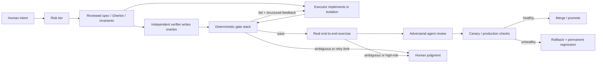

# Agentic QA Gauntlets

## Research question

How are frontier practitioners making agent-written software trustworthy without requiring humans to read every line, and which protocols and skills should be added to the kernel operating model?

The seed quote is real. It is [Robert C. Martin (Uncle Bob), replying to Ori Pomerantz on X on July 22, 2026](https://x.com/unclebobmartin/status/2080257779395154409). The reply thread materially clarifies the thesis:

- Martin does **not** review agent-written implementation code or unit tests.
- Agents also draft Gherkin acceptance tests and QA procedures.
- Martin reviews those behavioral oracles thoroughly for critical work and by spot check for lower-risk work, then periodically performs a final manual test.
- His deterministic quality metric example is [`unclebob/crap4java`](https://github.com/unclebob/crap4java), which combines cyclomatic complexity and test coverage.
- When asked who checks the checkers, he answered that agents write the relatively small deterministic constraint-checking tools.

The important correction is therefore: **review has not disappeared; it has moved from implementation syntax to intent, behavioral oracles, deterministic evidence, and sampled outcomes.**

## Claims

- Robert C. Martin's current practice is to avoid reading agent-written code while reviewing agent-written Gherkin acceptance tests and QA procedures according to criticality and occasionally performing final manual tests. [Source](https://x.com/unclebobmartin/status/2080257779395154409)
- OpenAI built an internal product with roughly one million lines of agent-written code, about 1,500 merged PRs in five months, and no manually written source; humans steer, specify acceptance criteria, validate outcomes, and increasingly delegate code review agent-to-agent. [Source](https://openai.com/index/harness-engineering/)
- OpenAI mechanically enforces architectural dependency direction, structured logging, naming, file-size limits, boundary parsing, documentation structure, and other invariants through custom linters and structural tests whose errors contain remediation instructions for agents. [Source](https://openai.com/index/harness-engineering/)
- OpenAI made isolated applications, browser control, screenshots, videos, logs, traces, and metrics directly legible to agents so they can reproduce failures and prove behavior rather than merely report that tests passed. [Source](https://openai.com/index/harness-engineering/)
- Anthropic found that coding agents often declare work complete after unit tests or `curl` checks even when the feature does not work end to end; explicitly requiring browser-driven testing as a user substantially improved results. [Source](https://www.anthropic.com/engineering/effective-harnesses-for-long-running-agents)
- Anthropic recommends combining deterministic code-based graders, calibrated model-based graders, and sampled human grading; deterministic outcome checks should be preferred where possible, and grading should test final state rather than merely claimed completion. [Source](https://www.anthropic.com/engineering/demystifying-evals-for-ai-agents)
- Stripe's unattended Minions produce more than 1,000 merged PRs weekly, but Stripe still requires human review; Minions run in isolated devboxes, execute selected local lints in under five seconds, enter a selective CI suite drawn from more than three million tests, receive autofixes where possible, and get at most two CI attempts. [Source](https://stripe.dev/blog/minions-stripes-one-shot-end-to-end-coding-agents)
- A 2025 study found LLM-generated suites with 100% line coverage but only 4% mutation score; mutation feedback raised the studied system from a 53% plateau to 89.5% mutation score, demonstrating that coverage alone is not a trustworthy oracle for agent-written tests. [Source](https://arxiv.org/abs/2506.02954)
- Meta applied mutation-guided LLM test generation to 10,795 Android Kotlin classes across seven products, generating 571 hardening tests; engineers accepted 73% of them, showing production-scale value but not eliminating human judgment. [Source](https://arxiv.org/abs/2501.12862)
- Trail of Bits warns that a test written solely to kill a surviving mutant can encode an implementation bug as the specification; ambiguous mutants require an external oracle rather than automatic acceptance. [Source](https://blog.trailofbits.com/2026/04/01/mutation-testing-for-the-agentic-era/)
- Kiro derives property-based tests from structured requirements and keeps traceability from requirement to property to test, while explicitly acknowledging that property-based testing is evidence rather than formal proof. [Source](https://kiro.dev/docs/specs/correctness/)
- Sonar's agent-specific quality gate blocks new reliability, security, dependency-risk, and major maintainability issues, requires at least 80% new-code coverage, and caps duplication at 3%; this is evidence that agent code is now receiving purpose-built gate profiles rather than generic linting. [Source](https://docs.sonarsource.com/sonarqube-cloud/standards/ai-code-assurance/quality-gate-for-agentic-ai)
- Semgrep Guardian moves SAST, dependency, malware, and secret scanning into the agent's write loop through MCP, hooks, and skills; the vendor reports over three million weekly scans and 95% under five seconds. [Source](https://semgrep.dev/blog/2026/introducing-semgrep-guardian-real-time-security-for-ai-written-code/)
- GitHub Spec Kit formalizes a `Spec → Plan → Tasks → Implement` flow with quality checklists and cross-artifact analysis, and now includes community workflows such as MAQA specifically for multi-agent quality-assurance gates. [Source](https://github.github.com/spec-kit/)
- The strongest public no-code-reading practice is not pure automation: frontier systems retain humans at the specification, calibration, exception, and outcome layers even when implementation and review are agent-produced. [Synthesis from Martin](https://x.com/unclebobmartin/status/2080257779395154409), [OpenAI](https://openai.com/index/harness-engineering/), [Anthropic](https://www.anthropic.com/engineering/demystifying-evals-for-ai-agents), and [Stripe](https://stripe.dev/blog/minions-stripes-one-shot-end-to-end-coding-agents).

## Summary

The frontier pattern is **oracle engineering**, not blind trust and not simply “more tests.” The human stops spending attention on implementation details and instead owns five things:

1. **Intent** — a falsifiable behavioral specification.
2. **Independence** — the implementation agent must not be the only author or judge of its tests.
3. **Deterministic gates** — types, lint, architecture, security, coverage, mutation, and outcome checks must fail closed.
4. **Observable proof** — the agent must exercise the real system and produce state, screenshots, video, logs, traces, or metrics that prove the claimed outcome.
5. **Calibration and escalation** — humans review the oracle at a risk-dependent rate, audit samples, inspect ambiguous failures, and convert escaped defects into permanent constraints.

A test suite written by the same model from the same context can share the implementation's blind spots. Coverage can be perfect while fault detection is nearly absent. Mutation testing improves test adequacy but cannot decide whether observed behavior is the intended behavior. LLM review adds breadth but is probabilistic. Therefore the gauntlet must contain **multiple independent witnesses**, with deterministic checks controlling merge and probabilistic checks remaining advisory unless calibrated.

The best practical near-term design for kernel is a risk-tiered, spec-first lifecycle where the Product Owner reviews behavior, an independent verifier derives acceptance and property tests without seeing the implementation, an executor implements in isolation, deterministic gates block progress, an end-to-end agent produces evidence, and only ambiguous or high-risk outcomes reach the human.

## What frontier practitioners are actually doing

| Practitioner / organization | Practice | What it proves | Residual human role |
|---|---|---|---|
| [Robert C. Martin](https://x.com/unclebobmartin/status/2080257779395154409) | Doesn't read implementation or unit tests; reviews Gherkin/QA procedures by risk; uses coverage, mutation, CRAP and manual spot tests | A veteran practitioner is explicitly shifting review from code to behavioral constraints | Reviews behavioral oracles, spot-checks, manual final tests |
| [OpenAI Codex team](https://openai.com/index/harness-engineering/) | Agent-written code, tests, CI, docs and tooling; custom architecture linters; isolated app/observability; browser proof; agent-to-agent review; recurring cleanup agents | A real million-line system can operate with almost all implementation and review delegated | Priorities, acceptance criteria, outcome validation, judgment escalations |
| [Anthropic](https://www.anthropic.com/engineering/effective-harnesses-for-long-running-agents) | Structured feature ledger, one feature per session, clean-state smoke test, browser automation, persistent progress artifacts | Explicit end-to-end verification stops premature “done” claims that unit tests miss | Harness design; future specialization into QA/testing agents remains open |
| [Anthropic eval practice](https://www.anthropic.com/engineering/demystifying-evals-for-ai-agents) | Deterministic + model + human graders; isolated trials; reference solutions; regression suites; `pass@k` and `pass^k`; transcript audits | Agent behavior can be measured as a product rather than judged anecdotally | Calibrate judges, inspect transcripts, repair flawed graders |
| [Stripe Minions](https://stripe.dev/blog/minions-stripes-one-shot-end-to-end-coding-agents) | Isolated devbox, deterministic orchestration around agent steps, sub-five-second lints, selective CI, autofix, two-CI-run cap | Existing mature developer infrastructure is the foundation for safe unattended execution | Human review remains required before merge |
| [Meta ACH](https://arxiv.org/abs/2501.12862) | Concern-specific mutations → LLM-generated tests → equivalent-mutant filtering | Mutation-guided hardening works at large production scale | Engineers still judged and accepted generated tests |
| [Trail of Bits](https://blog.trailofbits.com/2026/04/01/mutation-testing-for-the-agentic-era/) | Agent-optimized mutation tools, persistent results, targeted/two-phase campaigns, agent configuration skills | Mutation testing can become machine-legible and operationally practical | External validation for ambiguous semantics |
| [GitHub Spec Kit](https://github.github.com/spec-kit/) | Versioned intent artifacts and cross-artifact quality checks before implementation | Specs can be the navigable source of truth for many agent harnesses | Human still owns whether the spec expresses the right product |
| [Kiro](https://kiro.dev/docs/specs/correctness/) | Natural-language requirements → traceable properties → generated cases → counterexample shrinking | Property tests connect intent to broad input exploration | Decide whether failure means bad code, bad test, or bad requirement |
| [Sonar](https://docs.sonarsource.com/sonarqube-cloud/standards/ai-code-assurance/quality-gate-for-agentic-ai) | Agent-specific merge gate for security, reliability, dependencies, coverage and duplication | Agent-specific policies are productized and enforceable today | Choose risk thresholds and exceptions |
| [Semgrep](https://semgrep.dev/blog/2026/introducing-semgrep-guardian-real-time-security-for-ai-written-code/) | Inline scan every agent-touched file through hooks/MCP | Security feedback can arrive during generation rather than after CI | Maintain policies and triage novel findings |

## The no-code-reading gauntlet

### Gate 0 — Risk classification

Before an agent touches code, classify the change:

- **Tier 0 — reversible internal tooling:** deterministic fast gates + smoke test; sample only.
- **Tier 1 — normal product behavior:** reviewed acceptance criteria, independent tests, full deterministic stack, end-to-end evidence.
- **Tier 2 — auth, money, privacy, destructive data, external side effects:** Tier 1 plus property tests, mutation testing, security scan, rollback proof, and mandatory human review of the behavioral oracle and final evidence.
- **Tier 3 — safety-critical or irreversibly destructive:** formal model/proof where feasible and explicit human approval; no unattended merge.

This preserves Martin's spot-check model while preventing a blanket “never review” rule from being applied to critical code.

### Gate 1 — Executable intent contract

Every brief must contain:

- Given/When/Then acceptance scenarios;
- negative and abuse cases, not only the happy path;
- preconditions, postconditions and invariants;
- observable end state and exact evidence required;
- allowed files, dependencies and side effects;
- rollback and failure behavior;
- explicit non-goals.

The human reviews this artifact rather than implementation. A requirement without an observable oracle is not delegable under the no-code-reading model.

### Gate 2 — Structural independence

Use separate contexts and preferably separate agents:

- **Verifier** receives the contract and public interfaces, but not the executor's reasoning or implementation.
- **Executor** receives the contract and existing test command, but cannot edit protected acceptance tests or weaken thresholds.
- **Reviewer/red team** receives the contract, diff and evidence after deterministic gates pass, and tries to falsify the completion claim.

Independence is a system property, not a prompt such as “be critical.” Protected test paths and separate workspaces prevent the executor from silently rewriting its own exam.

### Gate 3 — Fast deterministic feedback

Run locally or on every push, ordered cheapest-first:

1. formatter check;
2. compile/type check;
3. lint with inline-disable suppression prohibited unless explicitly approved;
4. architecture/dependency-direction checks;
5. secret scan;
6. changed-file SAST and dependency scan;
7. targeted unit/contract tests.

Errors should include concrete remediation instructions. OpenAI and Stripe both use fast, mechanically enforced feedback before expensive CI.

### Gate 4 — Test adequacy, not just test execution

Require all of:

- changed behavior has unit/contract coverage;
- each acceptance criterion maps to at least one executable test or outcome check;
- branch/condition coverage meets the risk-tier threshold;
- the changed-code mutation score does not regress and clears the tier floor;
- no high-CRAP method is introduced without either reduced complexity or proportionate tests.

Coverage is a floor, not confidence. The MUTGEN 100%-coverage/4%-mutation result makes a coverage-only gate indefensible for agent-authored tests.

### Gate 5 — Property and metamorphic testing

For parsers, state machines, transformations, financial calculations, APIs and large input spaces, derive properties such as:

- round-trip invariants;
- idempotence;
- monotonicity;
- conservation / balance equations;
- permutation or representation invariance;
- authorization non-interference;
- bounded resource or latency behavior.

Use Hypothesis, fast-check, QuickCheck, jqwik or the project-language equivalent. Generated properties must be reviewed or independently graded; trivial assertions such as “returns the right type” do not count.

### Gate 6 — Mutation feedback loop

Per pull request:

1. mutate only changed or high-risk code;
2. run the relevant test slice;
3. feed surviving mutants to a verifier agent;
4. classify each as test gap, equivalent mutant, suspected implementation bug, or ambiguous requirement;
5. generate a test only when the spec establishes expected behavior;
6. escalate ambiguity rather than canonizing current behavior;
7. run the full mutation suite nightly or weekly.

Baseline diagnostically before imposing a hard threshold. Full-repository mutation testing is too slow for most per-PR loops; diff-scoped runs are the practical merge gate.

### Gate 7 — Real-system evidence

A passing test command is not enough. The agent must run the changed path using the interface a user or caller uses:

- UI: browser journey, DOM assertions, before/after screenshots or video;
- API: real request through middleware plus database/state verification;
- worker/job: enqueue through the real entrypoint and verify durable outcome;
- performance: query local metrics/traces against a stated SLO;
- integrations: sandbox or contract environment with captured requests and resulting state.

The evidence bundle should contain commands, exit status, artifact paths, environment identity, and relevant state diffs. The reviewer verifies evidence, not prose.

### Gate 8 — Bounded repair and escalation

The gate runner returns structured failures. The executor gets a bounded number of repair attempts—Stripe uses at most two CI rounds. After the limit:

- do not loop indefinitely;
- preserve the failing artifact and trace;
- escalate with the exact failed constraint;
- require a new decision if the spec or test appears wrong.

### Gate 9 — Production containment

For deployable changes, confidence also depends on blast-radius control:

- feature flag or canary where feasible;
- explicit health and business outcome metrics;
- automatic rollback condition;
- no schema-destructive operation without backward-compatible staging;
- escaped failures become permanent regression cases.

This is a derived operational recommendation: tests prove known properties; containment limits the cost of unknown failures.

### Gate 10 — Quality garbage collection

Schedule agents to scan for:

- architecture-rule violations;
- stale or contradictory docs/specs;
- increasing CRAP/complexity hotspots;
- flaky tests;
- declining mutation scores;
- repeated reviewer comments;
- orphaned feature flags and dependencies.

OpenAI reports replacing a weekly manual “AI slop” cleanup day with recurring Codex tasks that apply codified golden principles and open small refactoring PRs.

## Quality metrics worth tracking

| Metric | Role | Suggested use | Failure mode |
|---|---|---|---|
| Acceptance-criterion pass rate | Intent coverage | 100% for merge | Weak if criteria are incomplete |
| Requirement-to-test traceability | Detects silent missing features | Every required behavior has an oracle/evidence item | Mapping can be ceremonial unless exercised |
| Changed-line / branch coverage | Detects unexecuted code | Floor only; Sonar's agent gate uses ≥80% new-code coverage | 100% can still mean 4% mutation score |
| Mutation score | Measures whether tests detect injected faults | Baseline, then non-regression; risk-tier floors | Equivalent mutants and semantic ambiguity |
| CRAP score | Couples complexity with coverage | Block new high-CRAP methods or demand refactor/tests | Formula is heuristic, not correctness proof |
| New reliability/security/dependency findings | Deterministic risk gate | Zero new blocking findings | Rule coverage is incomplete |
| End-to-end outcome pass rate | Real behavior | Required changed-path smoke | Can miss unexercised paths |
| `pass^k` on critical evals | Consistency across repeated trials | Prefer for user-facing reliability; test multiple independent trials | Expensive; environment noise distorts score |
| Flake rate | Trustworthiness of the gate | Quarantine/fix flakes; never normalize reruns | A flaky gate trains agents to ignore failures |
| Repair-attempt count and escalation rate | Harness quality | Declining trend; hard retry cap | Low retries can hide task abandonment |
| Escaped defect / rollback rate by risk tier | Real-world calibration | Feed every incident back into the suite | Lagging metric; needs sufficient volume |
| Human audit defect rate | Calibrates automation | Random samples plus 100% Tier 2/3 oracle review | Sampling must be genuinely random |
| Time to deterministic feedback | Agent efficiency | Keep local gates seconds, targeted CI minutes | Optimizing speed can weaken breadth |

### CRAP metric

Martin's [`crap4java`](https://github.com/unclebob/crap4java) uses:

$$
\text{CRAP} = CC^2(1 - coverage)^3 + CC
$$

where $CC$ is cyclomatic complexity and coverage is a fraction. High coverage reduces the score toward complexity; low coverage sharply penalizes complex methods. The historical “crappy” threshold is often 30, but kernel should baseline real repositories before adopting a universal hard number.

## Protocols to build in kernel

Kernel is methodology-only, so these are workflow, role and template protocols. Project-specific tools should live in owning repositories.

### P0 — Build first

1. **Risk-tier and gate-matrix protocol**
   - Add a mandatory `RISK TIER` field to task briefs.
   - Define Tier 0–3 required gates and human review rate.
   - Prohibit unattended merge for Tier 3.

2. **Executable acceptance-contract protocol**
   - Extend `DONE LOOKS LIKE` with Given/When/Then, negative cases, invariants, state evidence and rollback behavior.
   - Human/Product Owner signs off on this artifact before implementation for Tier 1+.

3. **Protected independent-verifier protocol**
   - Verifier derives acceptance tests from the contract in a separate context before seeing implementation.
   - Executor cannot edit verifier-owned tests, thresholds, fixtures or gate config.
   - Test changes after implementation begin require verifier approval.

4. **Evidence bundle protocol**
   - Replace self-reported “tests pass” with raw command output, exit codes, artifact locations, browser/API evidence, state verification and environment identity.
   - No task moves to `done` unless the architect independently runs or validates the specified evidence.

5. **Bounded repair and escalation protocol**
   - Cheap local feedback first, then targeted CI.
   - Maximum two expensive CI repair rounds by default.
   - Escalation reports the failed invariant, not a narrative summary.

### P1 — Build after P0 is used on real work

6. **Deterministic quality-gate manifest**
   - Per-project machine-readable commands for format, types, lint, architecture, security, unit, integration, E2E, coverage and mutation.
   - Each gate declares cost, timeout, blocking/advisory status, risk tiers and artifact output.

7. **Mutation-testing protocol**
   - Diagnostic baseline period, diff-scoped PR gate, scheduled full run, survivor triage taxonomy, and explicit “do not generate a test without a spec oracle” rule.

8. **Property-test protocol**
   - Checklist for finding invariants and selecting Hypothesis/fast-check/etc.
   - Independent review of properties for Tier 2 work.

9. **Agent red-team review protocol**
   - Reviewer attempts to falsify each acceptance claim, checks forbidden changes and looks for test/gate weakening.
   - Probabilistic review is advisory until a deterministic failure or human-confirmed issue is produced.

10. **Production-containment protocol**
    - Required flag/canary/rollback conditions and post-deploy evidence for Tier 2 work.
    - Incident-to-regression conversion before closure.

### P2 — Build once measurement exists

11. **Harness eval suite**
    - 20–50 representative kernel tasks drawn from real failures.
    - Stable isolated environments, reference solutions, deterministic outcome graders and a small calibrated rubric layer.
    - Track pass@1, pass^k, cost, latency, retries and escalations.

12. **Quality-garbage-collection protocol**
    - Scheduled small audits for doc drift, architecture drift, flakiness, complexity, mutation regression and repeated agent mistakes.
    - Convert repeated comments into enforceable rules.

13. **Verifier calibration protocol**
    - Randomly audit low-risk completions and fully audit high-risk oracles.
    - Track false acceptance and false rejection rates.
    - Adjust gates using evidence, not intuition.

14. **Formal-verification lane**
    - Optional Dafny/Verus/TLA+ path for narrowly formalizable high-stakes state machines, financial logic and protocols.
    - Do not make this a general prerequisite; specification correctness remains the limiting factor.

## Recommended implementation sequence

### First 2 weeks — the compounding core

- Learn and add risk tiers.
- Upgrade the task brief to executable acceptance contracts.
- Split executor and verifier contexts.
- Require evidence bundles and bounded retries.
- Apply the model to one Tier 1 task and one Tier 2 task.

### Weeks 3–4 — deterministic depth

- Add per-project gate manifests.
- Wire type/lint/architecture/security/coverage gates as immutable required checks.
- Introduce changed-code mutation testing in diagnostic mode.
- Start tracking flake and escaped-defect rates.

### Month 2 — broader behavioral assurance

- Add property-based tests to suitable modules.
- Add browser/API state evidence and post-deploy containment.
- Turn stable mutation baselines into non-regression gates.
- Build a 20–50-task harness eval set from actual failures.

### Later — only where justified

- Agent-specific SAST/SCA products if open-source gates are insufficient.
- Formal verification for narrow high-stakes logic.
- Automatic merge only after measured audit defect rates remain acceptably low by risk tier.

## Skills to learn

Ordered by leverage for a solo operator using kernel.

| Priority | Skill | What competent looks like | Recommended tools / concepts |
|---|---|---|---|
| 1 | Behavioral specification and oracle design | Can turn intent into unambiguous positive, negative, boundary and failure scenarios without prescribing implementation | Gherkin/Cucumber, EARS requirements, pre/postconditions, invariants |
| 2 | CI gate engineering | Can turn every required check into a reproducible non-zero exit and protected merge condition; knows how to keep gates immutable to executors | GitHub Actions, branch protection/rulesets, artifact retention, fail-closed workflows |
| 3 | Test architecture | Can separate unit, contract, integration and E2E responsibilities; avoids mocks that prove plumbing rather than behavior | Project-native test framework, contract tests, test pyramids/diamonds |
| 4 | Property-based testing | Can express domain invariants, build generators and interpret shrunk counterexamples | Hypothesis (Python), fast-check (JS/TS), QuickCheck/jqwik |
| 5 | Mutation testing | Can configure diff-scoped campaigns, set evidence-based thresholds and distinguish equivalent mutants from real gaps | Stryker, mutmut/Cosmic Ray, PIT, mewt/MuTON |
| 6 | Static/security gate design | Can author and tune rules for auth boundaries, secrets, unsafe APIs and dependency risk without drowning in false positives | Semgrep, CodeQL, SonarQube, OSV-Scanner, Gitleaks |
| 7 | Agent eval engineering | Can create isolated tasks, deterministic graders, reference solutions, balanced cases, repeated trials and calibrated model rubrics | Anthropic eval framework concepts, pass@k, pass^k, transcript review |
| 8 | Browser and API automation | Can prove user-visible behavior and backend state, not just DOM text or HTTP status | Playwright/Puppeteer, API contract tests, database/state assertions, screenshot/video artifacts |
| 9 | Observability as a test oracle | Can express and verify latency/error/state SLOs against local or canary telemetry | OpenTelemetry, PromQL, LogQL, TraceQL, SLOs |
| 10 | Architecture fitness functions | Can encode module boundaries and design principles as structural tests rather than prose | dependency-cruiser, ArchUnit, custom AST/lint rules, schema validation |
| 11 | Risk-based QA and sampling | Can decide what is fully reviewed, sampled or automated based on reversibility and impact | risk matrices, random audit sampling, false-acceptance tracking |
| 12 | Formal methods literacy | Can recognize when a problem is formalizable and model a small state machine or invariant | Dafny/Verus first; TLA+ for distributed protocols later |

### Most important conceptual skill

Learn to write **oracles that do not merely restate the implementation**. The right question is not “did the tests pass?” It is “what independent fact would have to be true if the requirement were satisfied, and can a deterministic observer measure it?”

## Failure modes and limits

1. **The same agent writing code and tests can share one blind spot.** Separate contexts and protected tests reduce correlated failure.
2. **Coverage is execution, not verification.** It is useful only as one floor in a layered stack.
3. **Mutation score can reward codifying a bug.** A surviving mutant is a question; the external specification provides the answer.
4. **LLM review is not a deterministic gate.** Use it to find hypotheses; block merge only on reproducible evidence or an explicit human decision.
5. **A mathematically verified implementation can still implement the wrong specification.** Formal proof moves rather than eliminates the oracle problem.
6. **Flaky infrastructure destroys trust.** Anthropic emphasizes isolated stable eval environments; Stripe limits expensive retry loops.
7. **No-review is not yet the dominant public production practice.** Stripe still requires human PR review; Anthropic still calibrates graders with humans; OpenAI makes review optional but keeps humans responsible for outcomes.
8. **Minimal merge gates are context-dependent.** OpenAI accepts cheap corrections because its throughput and feedback systems are unusually strong. Copying minimal gates without the surrounding observability and cleanup machinery would be reckless.
9. **Vendor metrics are directional.** Semgrep's scan volume and blocked-issue claims and Sonar's gate defaults are vendor-reported/product defaults, not universal defect benchmarks.
10. **The gauntlet has maintenance cost.** Tests, specs, metrics and lints rot. Scheduled verification and garbage collection are part of the protocol, not optional cleanup.

## Decision for kernel

Adopt Martin's philosophy with one explicit correction:

> Humans should stop reading routine agent implementation code only after they own and calibrate the behavioral oracles, deterministic gates, and outcome evidence. Autonomy expands by measured risk tier, not by blanket trust.

The near-term target is not “zero human review.” It is **zero low-leverage review**: humans review intent, ambiguous semantics, critical evidence and sampled outcomes; machines continuously inspect syntax, structure, security, test adequacy and runtime behavior.

## Research method and confidence

This was a timeboxed research pass across six parallel tracks: quote provenance, spec/BDD workflows, mutation/coverage, autonomous coding platforms, property/formal/static analysis, and quality metrics/CI culture. Three workers returned substantive results; three hit provider rate limits. Missing slices were supplemented by direct searches and full reads of primary sources from Martin, OpenAI, Anthropic, Stripe, Meta, Trail of Bits, GitHub, Kiro, Sonar and Semgrep.

Confidence levels:

- **High:** direct quotes and documented practices from primary practitioner/organization sources.
- **Medium:** academic preprints with clear methods but limited replication, particularly recent 2026 work.
- **Low / excluded from decisions:** vendor anecdotes without independent validation and unsourced platform-comparison claims.

## Sources

### Primary practitioner and organization sources

- Robert C. Martin / Ori Pomerantz thread: <https://x.com/unclebobmartin/status/2080257779395154409>
- OpenAI, “Harness engineering: leveraging Codex in an agent-first world”: <https://openai.com/index/harness-engineering/>
- Anthropic, “Effective harnesses for long-running agents”: <https://www.anthropic.com/engineering/effective-harnesses-for-long-running-agents>
- Anthropic, “Demystifying evals for AI agents”: <https://www.anthropic.com/engineering/demystifying-evals-for-ai-agents>
- Anthropic, “Property-based testing for finding real bugs”: <https://www.anthropic.com/research/property-based-testing>
- Stripe, “Minions: Stripe's one-shot, end-to-end coding agents”: <https://stripe.dev/blog/minions-stripes-one-shot-end-to-end-coding-agents>
- GitHub Spec Kit: <https://github.github.com/spec-kit/>
- Kiro, “Correctness with Property-based tests”: <https://kiro.dev/docs/specs/correctness/>
- Sonar, “Quality gate for agentic AI”: <https://docs.sonarsource.com/sonarqube-cloud/standards/ai-code-assurance/quality-gate-for-agentic-ai>
- Semgrep, “Introducing Semgrep Guardian”: <https://semgrep.dev/blog/2026/introducing-semgrep-guardian-real-time-security-for-ai-written-code/>
- Trail of Bits, “Mutation testing for the agentic era”: <https://blog.trailofbits.com/2026/04/01/mutation-testing-for-the-agentic-era/>
- Uncle Bob's CRAP analyzer: <https://github.com/unclebob/crap4java>

### Research papers

- Wang et al., “Mutation-Guided Unit Test Generation with a Large Language Model” (MUTGEN): <https://arxiv.org/abs/2506.02954>
- Foster et al., “Mutation-Guided LLM-based Test Generation at Meta” (ACH): <https://arxiv.org/abs/2501.12862>

### Tools named in the protocol

- Stryker Mutator: <https://stryker-mutator.io/>
- PIT: <https://pitest.org/>
- mutmut: <https://mutmut.readthedocs.io/>
- fast-check: <https://fast-check.dev/>
- Hypothesis: <https://hypothesis.readthedocs.io/>
- Semgrep: <https://semgrep.dev/>
- CodeQL: <https://codeql.github.com/>
