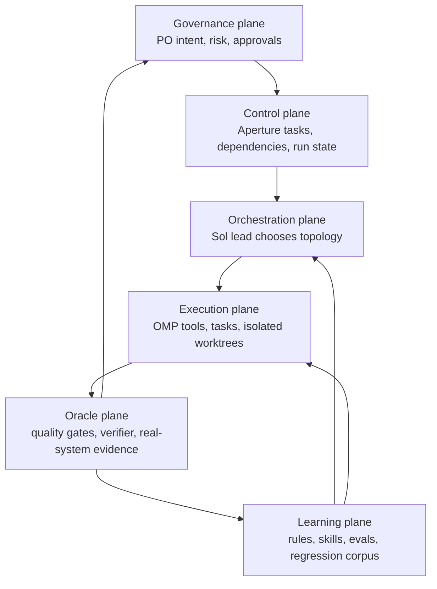

# Frontier Agentic Orchestration and Kernel v2

## Claims

- Frontier systems converge on a **central accountable orchestrator with bounded workers**, not a flat society of agents chatting freely. Anthropic uses an orchestrator-worker architecture; OpenAI documents manager-controlled “agents as tools”; Cursor's current swarm uses planner and worker tiers. [Anthropic](https://www.anthropic.com/engineering/multi-agent-research-system) · [OpenAI](https://openai.github.io/openai-agents-python/multi_agent/) · [Cursor](https://cursor.com/blog/agent-swarm-model-economics)
- Multi-agent execution is task-contingent rather than a universal upgrade. Anthropic reports its system is strongest on breadth-first, independently parallelizable research and poorly suited to tightly coupled domains; a Google/MIT study found every tested multi-agent topology degraded sequential reasoning tasks by 39–70%. [Anthropic](https://www.anthropic.com/engineering/multi-agent-research-system) · [Kim et al.](https://arxiv.org/html/2512.08296v1)
- Centralized coordination contains error propagation better than independent agents. The Google/MIT study measured 17.2× error amplification for independent agents versus 4.4× for centralized coordination. [Kim et al.](https://arxiv.org/html/2512.08296v1)
- Multi-agent performance is partly purchased with more inference. Anthropic reports agents using about 4× chat tokens and multi-agent systems about 15× chat tokens; it recommends multi-agent systems only where task value justifies the cost. [Anthropic](https://www.anthropic.com/engineering/multi-agent-research-system)
- The frontier chooses topology dynamically. A strong single lead handles tightly coupled or sequential work; parallel workers are introduced only for independent leaves; long projects use milestones and integration barriers. [Anthropic](https://www.anthropic.com/engineering/building-effective-agents) · [Factory](https://factory.ai/news/missions) · [Cursor](https://cursor.com/blog/agent-swarm-model-economics)
- Frontier coding control planes treat the issue tracker as the durable source of schedulable intent and each run as disposable execution. OpenAI Symphony continuously reads issues, creates an isolated workspace per issue, applies bounded concurrency and retries, and leaves workflow policy in a versioned repository contract. [Symphony](https://github.com/openai/symphony) · [Specification](https://github.com/openai/symphony/blob/main/SPEC.md)
- Every concurrent worker receives an isolated environment. OpenAI Codex uses worktrees, Cursor uses dedicated VMs, Cognition uses an isolated VM per managed Devin, and OMP uses isolated worktrees for task agents. [OpenAI](https://openai.com/index/introducing-the-codex-app/) · [Cursor](https://cursor.com/blog/self-hosted-cloud-agents) · [Cognition](https://cognition.com/blog/devin-can-now-manage-devins) · [OMP](https://github.com/can1357/oh-my-pi)
- The development environment is part of the agent product. Cursor identifies environment completeness as the largest determinant of cloud-agent quality; OpenAI's harness engineering likewise focuses on repository legibility, tools, architecture enforcement, and feedback loops rather than stronger prompting alone. [Cursor](https://cursor.com/blog/cloud-agent-lessons) · [OpenAI](https://openai.com/index/harness-engineering/)
- Long-running unattended work needs durable execution, not a longer chat. Cursor migrated its cloud-agent loop to Temporal for checkpointing, retries, hibernation/resumption, and runs lasting days or weeks; Temporal's OpenAI integration persists progress across crashes and rate limits. [Cursor](https://cursor.com/blog/cloud-agent-lessons) · [Temporal](https://temporal.io/blog/announcing-openai-agents-sdk-integration)
- Frontier systems put deterministic code around probabilistic agents. OpenAI documents code-driven routing, structured outputs, evaluator loops, and parallel calls; its guardrails can block tool calls before side effects. Anthropic recommends simple composable workflows before autonomous agents. [OpenAI orchestration](https://openai.github.io/openai-agents-python/multi_agent/) · [OpenAI guardrails](https://openai.github.io/openai-agents-python/guardrails/) · [Anthropic](https://www.anthropic.com/engineering/building-effective-agents)
- Frontier teams optimize for **proof of outcome**, not persuasive completion reports. OpenAI's agents produce CI, review, complexity, and walkthrough evidence; Factory inserts validation at every milestone; Kernel's QA research identifies executable oracles, deterministic gates, and real-system evidence as the frontier pattern. [Symphony](https://github.com/openai/symphony) · [Factory](https://factory.ai/news/missions) · [Kernel QA research](./agentic-qa-gauntlets-2026-07-24.md)
- Human attention moves upstream and to exceptions. OpenAI summarizes its operating model as “Humans steer. Agents execute”; Factory asks the human to approve scope before multi-day execution; production systems preserve human review for high-risk or ambiguous outcomes. [OpenAI](https://openai.com/index/harness-engineering/) · [Factory](https://factory.ai/news/missions)
- Specialized roles are useful as **ephemeral context partitions**, not permanent organizational identities. Cursor separates planners from workers to prevent low-level details from consuming planning context, while OpenAI recommends manager-controlled specialists for bounded subtasks. [Cursor](https://cursor.com/blog/agent-swarm-model-economics) · [OpenAI](https://openai.github.io/openai-agents-python/multi_agent/)
- Model routing is becoming an orchestration primitive. Cursor reports similar quality but radically different cost when frontier models plan and cheaper models execute; Factory explicitly treats model independence and routing as requirements of a software factory. [Cursor](https://cursor.com/blog/agent-swarm-model-economics) · [Factory](https://factory.ai/news/software-factory)
- The compounding asset is the harness: rules, tools, executable checks, skills, environments, traces, and regression cases that make the next agent run more reliable. OpenAI reports throughput increasing as repository legibility and feedback loops improve; Factory frames every review and incident as input to continual improvement. [OpenAI](https://openai.com/index/harness-engineering/) · [Factory](https://factory.ai/news/software-factory)

## Summary

The frontier is not converging on elaborate roleplay organizations. It is converging on a **thin deterministic control plane around a strong lead agent**, with dynamic delegation, isolated execution, machine-checkable outcome gates, durable state outside model context, and a learning loop that converts failures into permanent harness improvements.

The core topology is:

```text
human intent and risk policy
        ↓
durable work/control plane
        ↓
accountable lead chooses topology
        ├─ direct sequential execution
        ├─ bounded parallel workers
        └─ deterministic workflow/routine
        ↓
integration barrier + executable oracles
        ↓
evidence, risk-triggered review, deployment gate
        ↓
traces and escaped failures become rules/evals
```

Kernel was directionally early: Product Owner authority, Architect/Executor/Reviewer separation, briefs, file ownership, safety flags, verification, and Aperture already resemble the control-plane architecture now appearing in Symphony, Factory Missions, and cloud-agent products. Kernel's problem is not that it values orchestration. Its problem is that it **freezes one topology and one vendor stack into permanent roles**.

Kernel should be rewritten as a provider-neutral **harness constitution and topology selector**. OMP should supply the local execution substrate; Aperture should remain the durable control and approval plane; repository rules, skills, gate manifests, and evals should become the compounding intelligence layer.

## What frontier practitioners are doing

| System | Operating pattern | Important boundary |
|---|---|---|
| Anthropic Research | Lead agent plans and dispatches independent research directions, then synthesizes compressed findings | Multi-agent is expensive and poor for tightly coupled work |
| OpenAI Codex / Symphony | Issue tracker → isolated workspace → autonomous run → proof of work → human or workflow-defined handoff | Scheduler/runner is separate from task policy; policy stays in-repo |
| OpenAI harness engineering | Humans specify intent; agents write code, tests, tooling, docs, review, and cleanup; repository invariants fail closed | Agent capability compounds only when the environment is legible and enforceable |
| Factory Missions | Human approves scope; orchestrator divides a multi-day project into milestones; fresh workers execute features; every milestone validates integration | Parallelism occurs only where coordination overhead is low |
| Cursor Cloud | Dedicated environment per agent; durable Temporal workflow; controlled credentials/network; unattended work across days | The environment and durability layer matter as much as the model |
| Cursor Swarms | Frontier planner recursively grows a task tree; cheaper workers execute leaves; VCS mediates collisions | Research frontier, not a default for ordinary repository work |
| Cognition Managed Devins | Manager delegates to isolated Devins, observes complete trajectories, and improves future decomposition | Learning comes from trajectories and outcomes, not summary prose |
| OMP | One lead can spawn typed specialist tasks in isolated worktrees, message peers, receive async results, use advisor/reviewer agents, LSP/DAP/browser, and persistent memory | Excellent local execution substrate; not itself a cross-project portfolio/control plane |
| Temporal / LangGraph | Checkpointed state, retries, human interruptions, resumability, and long-lived workflow identity outside model context | Needed for unattended multi-day production workflows, excessive for ordinary interactive coding |

## Convergent design principles

### 1. One accountable lead, not consensus

The lead owns the user intent, decomposition, integration, and final evidence. Workers return bounded outputs; they do not collectively negotiate product direction. Peer communication exists to resolve interfaces, not to form an agent parliament.

### 2. Topology follows task shape

- **Sequential/tightly coupled:** one strong lead executes directly.
- **Breadth-first/independent:** lead dispatches parallel workers.
- **Large project:** milestones with fresh contexts and validation barriers.
- **Repeated deterministic process:** code workflow first; agent only at ambiguous nodes.
- **Long-running unattended process:** durable workflow engine, checkpoints, retries, and human interrupt points.

### 3. Context is allocated, not shared indiscriminately

Workers get the minimum contract and tools their slice needs. They return compressed conclusions or isolated changes. Full transcripts remain available for audit but do not flood the lead's active context.

### 4. State lives outside the model

Issues, run status, dependencies, approvals, artifacts, and retry counts are machine-readable state. The conversation is not the database. Repository rules and workflow contracts are versioned with the code.

### 5. Autonomy is bounded by reversible actions

Deterministic tool guards and human approvals surround money, deployment, data deletion, schema migration, credentials, and production mutation. Cheap/reversible actions run autonomously; expensive or irreversible actions stop at explicit gates.

### 6. Verification is an independent system

“Agent says done” is not a state transition. Deterministic gates and real-system exercise produce evidence. Independent reviewers try to falsify claims at risk-dependent depth. Repair loops are bounded; repeated failure escalates with the failed invariant.

### 7. Failures improve the harness

Every escaped defect or repeated correction should become one of:

- a project rule,
- a skill,
- a tool contract,
- a deterministic lint or architecture check,
- a regression test,
- an eval case,
- a better environment fixture,
- or a topology-selection rule.

## Kernel assessment

### Already aligned with the frontier

- Product Owner owns direction and irreversible approvals.
- Briefs contain falsifiable acceptance and verification sections.
- Tasks have safety flags and dependency gates.
- Executors have file ownership boundaries.
- Review is structurally independent.
- Aperture exposes durable tasks, approvals, run state, and live logs.
- Session/workspace claims protect separate top-level sessions.

### Stale assumptions

- `Architect`, `Executor`, and `Reviewer` are permanent provider-specific identities rather than capabilities selected per task.
- The Architect is prohibited from implementing even when a task is sequential and one context is safer.
- Every implementation requires a document handoff to Codex.
- The task lifecycle assumes one executor and one fixed linear topology.
- Worktree creation, communication, reports, and result parsing are manually specified despite OMP providing native equivalents.
- Aperture's execution path is hardcoded to Codex and to several Markdown table formats.
- Completion relies heavily on prose reports and status edits instead of a normalized evidence contract.
- Context recovery is duplicated across `CONTEXT.md`, session logs, task tables, memories, and provider transcripts without a clear authority hierarchy.

### Missing frontier primitives

- Explicit topology selection based on task coupling, parallelism, duration, and risk.
- Risk tiers mapped to mandatory machine gates and human approval posture.
- Machine-readable per-project verification manifests.
- Structured evidence bundles.
- Durable run identities and resumability for genuinely long-running work.
- Trace-to-regression/eval conversion.
- Cost-aware model routing.
- Measured orchestration quality: pass@1, consistency, cost, latency, retries, escaped defects, and human escalations.

## Recommended Kernel v2 orientation

### Kernel's new job

Kernel should stop being a cast of agents. It should define the **governance and feedback system within which any capable agent harness operates**.



### Replace permanent roles with capabilities

| Capability | Default owner | When active |
|---|---|---|
| Product authority | merulox | Always |
| Accountable lead | Sol/frontier model | Every task |
| Planner-only context | Frontier model | Mission mode or very large task trees |
| Worker | OMP task agent, often cheaper model | Independent implementation/research leaf |
| Verifier | Separate agent/context plus deterministic gates | By risk tier |
| Durable runner | systemd/Temporal/Symphony-like service | Unattended scheduled or multi-day work |

The lead may implement directly in **Direct mode**. Planner/worker separation becomes mandatory only in **Mission mode**, where preserving planning context provides enough value to justify the handoff.

### Define four execution modes

#### Direct mode

Use for ordinary bug fixes, features, and sequential work.

```text
intent → lead researches → lead implements → gates → smoke test → done
```

No executor brief or separate implementation report. OMP todo is session-local execution state. Independent review is risk-triggered.

#### Fan-out mode

Use for several independent slices that can be executed and verified separately.

```text
lead defines contracts → parallel isolated workers → lead integrates → gates → evidence
```

Workers return typed results. No worker receives responsibility for the top-level product decision.

#### Mission mode

Use for work spanning many hours, milestones, or context windows.

```text
human-approved intent → planner builds milestone DAG
→ fresh workers execute leaves
→ validation barrier after each milestone
→ bounded repair or escalation
→ final evidence
```

The planner does not implement in this mode. Parallelism is allowed only between leaves with explicit interfaces and no hidden shared state.

#### Routine mode

Use for repeated scheduled/business workflows.

```text
deterministic workflow owns state, retries, and side effects
→ agent handles ambiguous judgment nodes
→ human gate handles consequential actions
```

Do not burn an autonomous agent loop on work that ordinary code can perform reliably and cheaply.

### Reorient Aperture

Aperture should become a **Symphony-lite provider-neutral control plane**, not a second agent harness:

- canonical work item and dependency state,
- PO inputs and confirmations,
- risk tier and required gates,
- OMP run/session identity,
- artifact/evidence links,
- retry and escalation state,
- service and deployment visibility.

OMP should own in-session decomposition, tools, subagent isolation, peer messaging, and local verification. Aperture should launch or resume OMP runs and observe them, not reproduce those primitives.

### Replace the lifecycle

Current:

```text
backlog → briefed → in_progress → review → done
```

Kernel v2:

```text
proposed → ready → running → evidence_ready → verified → closed
              ↘ needs_input
              ↘ blocked
              ↘ rework
```

Risk and approvals are orthogonal gates, not statuses:

```text
risk_tier: 0 | 1 | 2 | 3
requires: [po_scope, data, schema, deploy, money, security, independent_oracle]
```

`closed` means the effect is demonstrated in the real target environment or explicitly accepted as a non-deployed artifact. A run can succeed while the work item remains at `evidence_ready` or `needs_input`.

## What not to copy

- Do not imitate thousand-agent swarms for normal repository work. They are research systems for unusually large, parallel tasks and require custom coordination infrastructure.
- Do not build free-form agent-to-agent debate. It increases context and error propagation without clear ownership.
- Do not add Temporal merely because it is fashionable. Use it only when real unattended runs must survive process/machine failures across long periods; OMP sessions and systemd are sufficient below that threshold.
- Do not replace deterministic pipelines with agent loops. Repeated known transformations remain code.
- Do not treat a stronger model as permission to remove outcome gates. Stronger agents increase the value of good environments and oracles.
- Do not make every task produce a permanent spec. Persist only what must cross sessions, agents, approvals, or audits.
- Do not rewrite Aperture into another OMP. Keep control-plane and execution-plane boundaries explicit.

## Recommended migration

1. **Write Kernel v2 beside v1.** Preserve the current system until the new operating model is demonstrated.
2. **Define topology selection and risk tiers first.** These determine when Direct, Fan-out, Mission, and Routine modes apply.
3. **Adopt the QA gauntlet's executable acceptance contract and evidence bundle.** This is the durable contract between control plane and execution plane.
4. **Pilot three real tasks:** one Direct, one Fan-out, one Mission. Measure elapsed human attention, retries, merge conflicts, verification defects, tokens/cost, and escaped issues.
5. **Then reorient Aperture.** Replace the Codex-specific launch path with an OMP run adapter and normalized run/evidence records only after the modes are proven manually.
6. **Archive provider-specific role docs after cutover.** Retain them as historical v1, not active instructions.
7. **Build an eval corpus from Kernel's own failures.** The goal is not a beautiful methodology document; it is a harness whose measured reliability improves.

## Decision

Kernel needs a **rewrite in orientation, not a deletion**.

Its durable insight—explicit authority, bounded scope, independent verification, and live-state proof—is more relevant at the frontier than when it was written. Its obsolete layer is the fixed Claude-Architect/Codex-Executor organization and the bespoke mechanics required to keep those handoffs coherent.

The target is:

> **Kernel = governance, topology selection, oracles, and learning.**
> **OMP = local agent execution substrate.**
> **Aperture = durable control and approval plane.**
> **systemd/Temporal = durable routine substrate, selected by required reliability.**

## Sources

### Primary practitioner sources

- Anthropic, [Building effective agents](https://www.anthropic.com/engineering/building-effective-agents)
- Anthropic, [How we built our multi-agent research system](https://www.anthropic.com/engineering/multi-agent-research-system)
- OpenAI, [Harness engineering: leveraging Codex in an agent-first world](https://openai.com/index/harness-engineering/)
- OpenAI, [Introducing the Codex app](https://openai.com/index/introducing-the-codex-app/)
- OpenAI Agents SDK, [Agent orchestration](https://openai.github.io/openai-agents-python/multi_agent/)
- OpenAI Agents SDK, [Guardrails](https://openai.github.io/openai-agents-python/guardrails/)
- OpenAI, [Symphony](https://github.com/openai/symphony) and [service specification](https://github.com/openai/symphony/blob/main/SPEC.md)
- Cursor, [What we've learned building cloud agents](https://cursor.com/blog/cloud-agent-lessons)
- Cursor, [Run cloud agents in your own infrastructure](https://cursor.com/blog/self-hosted-cloud-agents)
- Cursor, [Agent swarms and the new model economics](https://cursor.com/blog/agent-swarm-model-economics)
- Cognition, [Devin can now Manage Devins](https://cognition.com/blog/devin-can-now-manage-devins)
- Factory, [Introducing Missions](https://factory.ai/news/missions)
- Factory, [From coding agents to software factories](https://factory.ai/news/software-factory)
- Temporal, [Production-ready agents with the OpenAI Agents SDK + Temporal](https://temporal.io/blog/announcing-openai-agents-sdk-integration)
- LangGraph, [Overview](https://docs.langchain.com/oss/python/langgraph/overview)
- OMP, [Oh My Pi repository and feature overview](https://github.com/can1357/oh-my-pi)

### Research evidence

- Kim et al., [Towards a Science of Scaling Agent Systems](https://arxiv.org/html/2512.08296v1)
- Kernel, [Agentic QA Gauntlets](./agentic-qa-gauntlets-2026-07-24.md)
